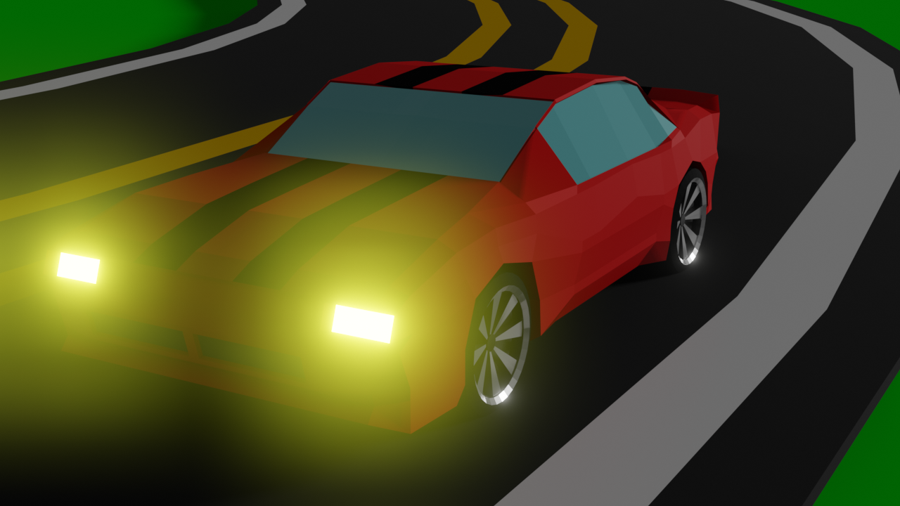
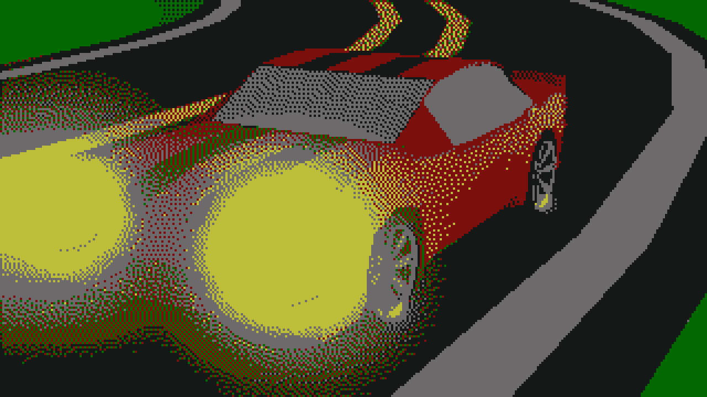

# quantization
Simple image quantization and dithering effect in C

I was just playing around with dithering..

Not even usable from terminal..

# Example
Original image:

Downscaled 4x, dithered and upscaled back:

